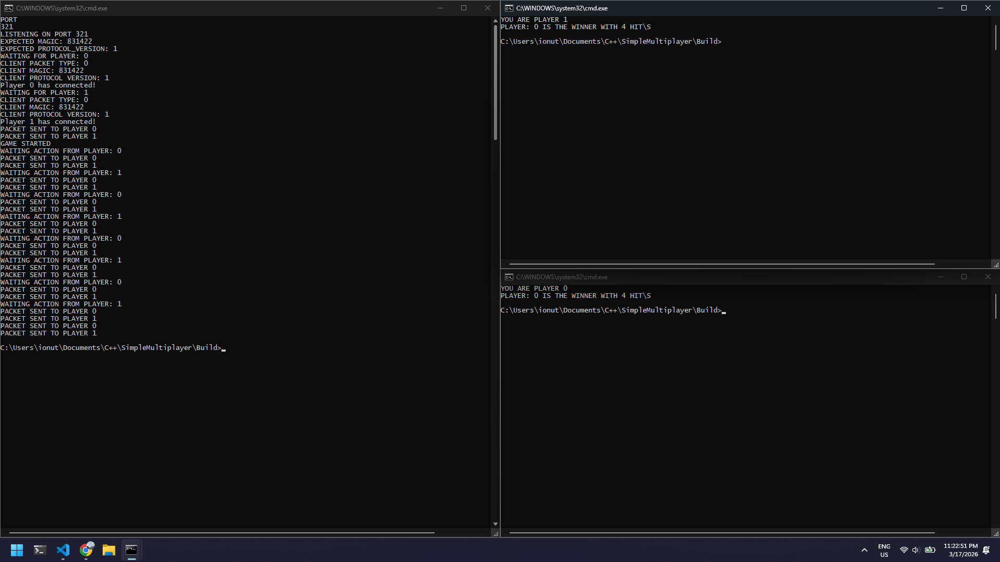
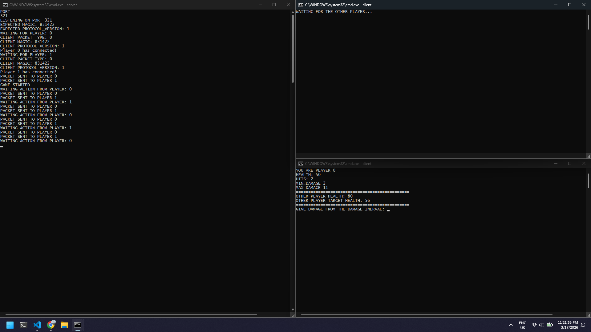

# Simple C++ TCP Multiplayer Game

## Overview

This project is a **simple TCP multiplayer game written in C++**, built as a learning exercise to understand the fundamentals of:

* Client–Server architecture
* TCP networking using sockets
* Packet-based communication
* Turn-based multiplayer logic

The goal of this project is not performance or scalability, but to provide a **clear and practical introduction** to how multiplayer games work under the hood.

---

## How To Play
* The players have a target health that they will loose at, a player needs to deal damage from a random min and max damage interval to get to the target.

* If the player gets to the target it wins and the other player looses, or if the the damage delt is over the target then the player looses and the other player wins.

---

## Learning Objectives

By building this project, you will learn:

* How to create a TCP server and accept clients
* How to connect a client to a server
* How to design and send structured packets
* How to safely receive data over a network
* How to synchronize game state between multiple players
* How to handle turn-based gameplay logic

---

## Project Structure

```
project/
├── Engine/
|  ├── Game.h
|
├── Network/
│   ├── Server.h
│   ├── Client.h
|   ├── Packet.h
│
├── ServerPackets.h
├── ServerSettings.h
|
├── main_client.cpp
├── main_server.cpp
│
└── README.md
```

---

## Networking Model

This project uses a **client-server model**:

* The **server**:

  * Waits for players to connect
  * Validates clients using a handshake
  * Controls the game logic
  * Sends updates to all players

* The **client**:

  * Connects to the server
  * Sends actions (player input)
  * Receives game state updates

---

## Handshake System

Before the game starts, the client must identify itself.

### Client → Server

Sends a `HelloPacket` containing:

* Handshake magic number
* Protocol version

### Server → Client

If valid, the server responds with:

* `WelcomePacket` (contains player ID)

This ensures:

* Only valid clients can connect
* Client and server use the same protocol

---

## Packet System

Communication is done using **structured packets**.

### Example Packets

* `HelloPacket` → Client identification
* `WelcomePacket` → Assign player ID
* `GameStatePacket` → Full game state
* `HitActionPacket` → Player action
* `HitResultPacket` → Result of action

All packets are sent using:

```cpp
SendPacket(socket, &packet, sizeof(packet));
```

And received using:

```cpp
ReceivePacket(socket, &packet, sizeof(packet));
```

---

## Game Flow

1. Server starts and listens for connections

2. Clients connect and send handshake

3. Server validates clients and assigns player IDs

4. Server sends initial game state

5. Game loop begins:

   * Current player sends an action
   * Server processes action
   * Server sends result
   * Server broadcasts updated game state

6. Game ends when a win condition is met

---

## Important Concepts

### 1. Blocking Sockets

* `recv()` and `send()` are blocking
* The program waits until data is received/sent

### 2. Packet Consistency

* Client and server **must use identical structs**
* Use `#pragma pack(1)` to avoid padding issues

### 3. Synchronization

Both client and server must follow the **exact same order of communication**.

Example:

```
Client:  send action
Server:  receive action
Server:  send result
Client:  receive result
```

If this order breaks → the connection desynchronizes.

---

## Common Issues

*  Using `send()` instead of `recv()` when receiving
*  Sending uninitialized data
*  Struct padding differences
*  Mismatched packet order
*  Client and server expecting different packets

---

## Possible Improvements

* Add packet headers (type + size)
* Implement non-blocking sockets (`select` / `poll`)
* Add error handling and reconnection
* Serialize data instead of sending raw structs
* Support more than 2 players

---

## Purpose of This Project

This project was built to:

> Learn the basics of multiplayer programming, including server and client creation, and sending/receiving packets.

It is intentionally simple to make the core concepts easy to understand.

---

## Conclusion

This project demonstrates the foundation of multiplayer games:

* Communication
* Synchronization
* Game state management

Once these basics are understood, you can move on to more advanced topics like:

* Real-time multiplayer
* Prediction & interpolation
* Dedicated game servers

---

## By ZipiRo


